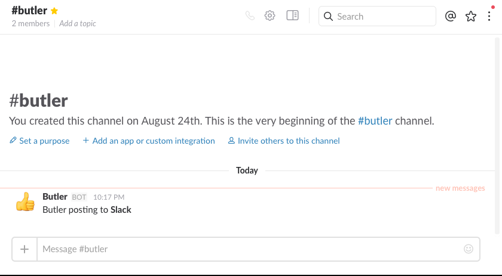

# Butler for Qlik Sense

> Proxy app for carrying out features that Qlik Sense cannot do out of the box.

## Overview

Node.js based proxy app providing various add-on features to Qlik Sense, such as starting reload tasks or posting to Slack from the load script, keeping track of currently active users and much more.  

The app started out as a way of posting to [Slack](https://slack.com/) from [Qlik Sense](http://www.qlik.com/products/qlik-sense) (or [QlikView](http://www.qlik.com/products/qlikview)) load scripts, but has since been generalized and now offers a lot more features.

Full documenation available [here](https://ptarmiganlabs.github.io/butler).

## Version history

Available in the [changelog file](changelog.md).

## Main features

* Integration with MQTT pub-sub protocol
* Sending messages to [Slack](https://slack.com) instant messaging system
* Start Sense tasks from the load script, or from external/3rd party systems
* Send emails and MQTT messages when Sense reload tasks fail
* Real-time info on how many and what users are currently active on the Sense server(s)

## Screen shots

### Posting to Slack, including message formatting and emojis
  
---
  

---

### Real-time view of # of active users

  
---

## Contributing

Pull requests and stars are always welcome. For bugs and feature requests, [please create an issue](https://github.com/mountaindude/qliksensebutler/issues/new).

## Author

Göran Sander
  
## License

Copyright © 2016 Göran Sander
Released under the MIT license.

---
