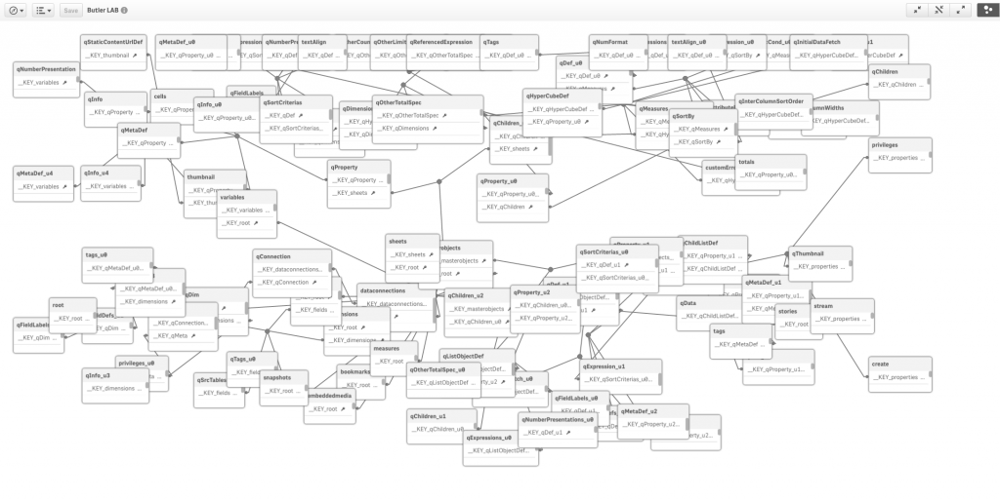

# Examples on how to use Butler

## Call Butler REST endpoints from within Sense load scripts

While it is quite possible to call the Butler REST endpoints directly from a LOAD...FROM statement, it is usually more convenient to use the subroutine wrappers that are available as .qvs files in the sense_script folder in the Butler repository.

Before doing any calls to Butler, we should initialize things. Failing to do so might lead to errors and unpredictable responses from the Butler APIs.    

    $(Must_Include=[lib://Butler scripts/butler_init.qvs]);
    CALL ButlerInit;

Note:  

- We first include the subroutine from a .qvs file, then call it. The same concept is used throughout Butler when it comes to making use of Butler features from the Sense load script.
- The Butler qvs files are stored in a folder on the Sense server, which is linked to a data connection called "Butler scripts".  

With this taken care of, we can call any other Butler API.

### Posting to Slack
    $(Must_Include=[lib://Butler scripts/butler_init.qvs]);
    $(Must_Include=[lib://Butler scripts/post_to_slack.qvs]);

    CALL ButlerInit;
    CALL PostToSlack('sense-reload-info', 'server: senseServer1', '*<App name>*: reload starting', ':ghost:');	// Post a starting message to Slack
    CALL PostToSlack('sense-reload-info', subfield(OSUser(),'UserId=',2) & ' on server: ' & ComputerName(), '*Reloaded by: ' & subfield(OSUser(),'UserId=',2) & '* <App name>: Reload starting', ':test:');  

This will result in the following Slack entries:  
  
  

### Start a Sense task
    $(Must_Include=[lib://Butler scripts/butler_init.qvs]);
    $(Must_Include=[lib://Butler scripts/start_task.qvs]);

    CALL ButlerInit;
    CALL StartTask('abcd1234-5678-abcd-1234-abcd1234abcd');     // Parameter should be ID of the task that is to be started

### Post a message to an MQTT topic 

    $(Must_Include=[lib://Butler scripts/butler_init.qvs]);
    $(Must_Include=[lib://Butler scripts/post_to_slack.qvs]);

    CALL ButlerInit;
    CALL PostToMQTT('qliksense/myapp/reload_status', 'starting');   // Posting message "starting" to topic "qliksense/myapp/reload_status"

### Create a directory on disk

    $(Must_Include=[lib://Butler scripts/butler_init.qvs]);
    $(Must_Include=[lib://Butler scripts/create_directory.qvs]);

    CALL ButlerInit;
    CALL CreateDir('d:/abc/def/ghi');       // Note that forward slashes work
    CALL CreateDir('d:\123\456\789');       // Backslashes work too

### List all Sense apps on the server

    // "Sense list apps" is a data connection using Qlik's standard REST connector, connected 
    // to http://<FQDN or IP of Butler server>:8080/senseListApps
    // The Apps table will contain id and name of all apps on the server

    LIB CONNECT TO 'Sense list apps';

    RestConnectorMasterTable:
    SQL SELECT 
        "id",
        "name"
    FROM JSON (wrap on) "root";

    Apps:
    LOAD	
        [id] 	AS [App id],
        [name] 	AS [App name]
    RESIDENT RestConnectorMasterTable;

    DROP TABLE RestConnectorMasterTable;

### Serialise a Sense app to JSON and a Sense data model 

Create a data connection (for example called "Sense app extract") using Qlik's REST connector, against http://<FQDN or IP of Butler server>:8080/senseAppDump
This will generate several thousands lines of code in the Sense script editor, modelling a Sense app's internal data model. 
The Butler endpoint returns a JSON, which the REST connector then transforms into a Sense data model.
To dynamically control which app is serialized you can use the "with connection" syntax.
    
    LIB CONNECT TO 'Sense app extract';

    let vAppId = 'abcd1234-5678-abcd-1234-abcd1234abcd';

    RestConnectorMasterTable:
    SQL SELECT 
	"loadScript",
    ...
    FROM JSON (wrap on) "root" PK "__KEY_root"
    WITH CONNECTION (
    QUERY "guid" "$(vAppId)");
    ...

Here is what the Sense data model can look like for a Sense app:

  

## Use MQTT to start Sense tasks

Butler is configured to listen to a specific MQTT topic, qliksense/start_task, and use any message received in that topic as a Sense task ID, which is then started. 
  
For example:  

* A Sense app, used by end users, relies on data in a MS SQL Server database.   
* The data in the datbase can be updated at any time. 

In order to update the Sense app with data, the most common approach is to schedule reloads of the app at certain intervals, i.e. polling the database.  
But if the database instead posts a MQTT message on the qliksense/start_task topic when new data is available, the database will trigger the Sense app's reload.
  
This way the Sense app will be updated as quickly as possible after new data is availabe in the database.  
*I.e. the end user will have access to more up-to-date data, compared to the polling based solution.*

