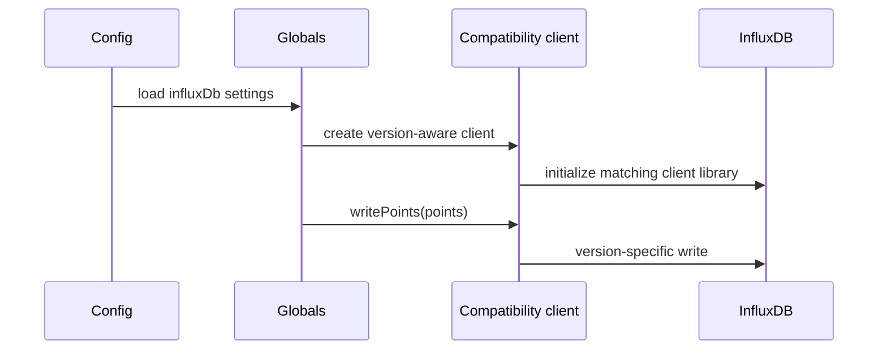

# InfluxDB v2 and v3 Support in Butler

## Goal

Add Butler support for InfluxDB v2 and v3 without rewriting the existing event-producing code that already targets the legacy InfluxDB v1 client API.

## Architecture

The implementation keeps Butler's existing `globals.influx.writePoints(...)` contract intact. Instead of changing every caller, Butler now creates a small compatibility client during startup:

- **InfluxDB v1**: forwards calls to the existing `influx` npm package.
- **InfluxDB v2**: converts legacy Butler point objects into `@influxdata/influxdb-client` `Point` instances and writes them via `getWriteApi(...)`.
- **InfluxDB v3**: converts legacy Butler point objects into `@influxdata/influxdb3-client` `Point` instances, serializes them to line protocol, and writes them to the configured database.

This keeps the change set focused in startup/config/runtime glue while preserving current v1 behavior.

```mermaid
flowchart LR
    A[Butler event code<br/>writePoints legacy payload] --> B[Compatibility client]
    B -->|version 1| C[influx package]
    B -->|version 2| D[@influxdata/influxdb-client]
    B -->|version 3| E[@influxdata/influxdb3-client]
```

### Modular Refactoring

The old monolithic `src/lib/post_to_influxdb.js` was replaced with a modular directory at `src/lib/influxdb/`:

| File | Purpose |
|------|---------|
| `client.js` | `InfluxDbCompatClient` class + `createInfluxDbClient()` factory |
| `index.js` | Central re-export barrel (backward-compatible with old imports) |
| `task_success.js` | 5 task success notification functions |
| `task_failure.js` | 5 task failure notification functions |
| `butler_metrics.js` | Butler process memory usage metrics |
| `qlik_sense_version.js` | Qlik Sense version info |
| `qlik_sense_license.js` | Server license, per-user license, released license status |
| `windows_service.js` | Windows service state metrics |
| `__tests__/client.test.js` | Compatibility client tests (v1/v2/v3) |
| `__tests__/task_success.test.js` | Success notification tests |
| `__tests__/task_failure.test.js` | Failure notification tests |

The old file `src/lib/post_to_influxdb.js` was removed — all imports now point to the modular structure.

## NPM Dependencies

| Package | Version | Used for |
|---------|---------|----------|
| `influx` | ^5.12.0 | InfluxDB v1 (existing, unchanged) |
| `@influxdata/influxdb-client` | ^1.35.0 | InfluxDB v2 (new) |
| `@influxdata/influxdb3-client` | ^2.2.0 | InfluxDB v3 (new) |

## Configuration Model

The Butler config template now uses the same high-level versioned concept as Butler-SOS:

```yaml
Butler:
    influxDb:
        enable: false
        hostIP: influxdb.mycompany.com
        hostPort: 8086
        version: 1                     # 1, 2, or 3

        # --- InfluxDB v1 ---
        v1Config:
            auth:
                enable: false
                username: user_joe
                password: joesecret
            dbName: butler
            retentionPolicy:
                name: 10d
                duration: 10d

        # --- InfluxDB v2 ---
        v2Config:
            org: my-org
            bucket: butler
            token: my-v2-token
            description: Butler metrics    # informational only (not used at runtime)
            retentionDuration: 10d         # informational only (not used at runtime)

        # --- InfluxDB v3 ---
        v3Config:
            database: butler
            token: my-v3-token
            description: Butler metrics    # informational only (not used at runtime)
            retentionDuration: 10d         # informational only (not used at runtime)
            writeTimeout: 10000
            queryTimeout: 60000
```

For backward compatibility, Butler still accepts legacy flat v1 settings (`Butler.influxDb.auth`, `Butler.influxDb.dbName`, `Butler.influxDb.retentionPolicy`) when `version` is omitted or set to 1 and no `v1Config` block is present.

### Event-Type Config Sections

Each event type has its own enable/disable switch and tag configuration:

| Config path | Description |
|-------------|-------------|
| `reloadTaskFailure` | Failed reload tasks (enable, tailScriptLogLines, tag with static/dynamic) |
| `reloadTaskSuccess` | Successful reload tasks (enable, allReloadTasks, byCustomProperty, head/tailScriptLogLines, tag) |
| `userSyncTaskSuccess` | Successful user sync tasks |
| `userSyncTaskFailure` | Failed user sync tasks |
| `externalProgramTaskSuccess` | Successful external program tasks |
| `externalProgramTaskFailure` | Failed external program tasks |
| `distributeTaskSuccess` | Successful distribute tasks |
| `distributeTaskFailure` | Failed distribute tasks |
| `preloadTaskSuccess` | Successful preload tasks |
| `preloadTaskFailure` | Failed preload tasks |

### Feature-Level InfluxDB Destinations

Several Butler features include InfluxDB as a configurable destination:

| Feature | Config path | What is stored |
|---------|-------------|----------------|
| Qlik Sense version | `Butler.qlikSenseVersion.versionMonitor.destination.influxDb` | Sense version metadata |
| Server license | `Butler.qlikSenseLicense.serverLicenseMonitor.destination.influxDb` | License expiry + days remaining |
| Per-user license | `Butler.qlikSenseLicense.licenseMonitor.destination.influxDb` | Aggregated license usage |
| License release | `Butler.qlikSenseLicense.licenseRelease.destination.influxDb` | Released license info |
| Windows service monitor | `Butler.windowsServiceMonitor.alertDestination.influxDb` | Service state + startup mode |
| UDP queue metrics | `Butler.udpServerConfig.messageQueue.queueMetrics.influxdb` | Queue health/backpressure/performance (config and infrastructure exist, but runtime write code not yet implemented) |

## Compatibility Client

The `InfluxDbCompatClient` class (`src/lib/influxdb/client.js`) wraps the underlying client library:

```
constructor({ version, client, org, bucket, database })
```

### writePoints(points)

Version-dispatched write method:
- **v1**: forwards directly to `client.writePoints(points)` (influx npm package)
- **v2**: converts each point via `createPointV2()` → writes via lazily-created `WriteApi` → calls `flush()`. The `WriteApi` instance is reused across calls to avoid per-write overhead. Flush is called after each write to preserve `await writePoints()` semantics.
- **v3**: converts each point via `createPointV3()` → serializes to line protocol → submits via `client.write(lineProtocol, database)`

All versions wrap errors with a `"InfluxDB v{N} write error: "` prefix for clear identification.

### getDatabaseNames()

- **v1**: delegates to `client.getDatabaseNames()`
- **v2/v3**: returns configured bucket/database name as a synthetic single-element array (no server query)

### createDatabase(name) / createRetentionPolicy(name, options)

- **v1**: delegates to underlying client
- **v2/v3**: return `undefined` (no-op)

### Point Conversion

Legacy Butler point format:
```js
{
    measurement: 'measurement_name',
    tags: { key: 'value', ... },
    fields: { key: value, ... },  // number | boolean | string
    timestamp: Date | number | string  // optional
}
```

Conversion to v2 (src/lib/influxdb/client.js:151):
```js
// Uses @influxdata/influxdb-client Point
point.tag(key, String(value))
point.floatField(key, value) / point.booleanField(key, value) / point.stringField(key, value)
point.timestamp(value)
```

Conversion to v3 (src/lib/influxdb/client.js:179):
```js
// Uses @influxdata/influxdb3-client Point
point.setTag(key, String(value))
point.setFloatField(key, value) / point.setBooleanField(key, value) / point.setStringField(key, value)
point.setTimestamp(value)
```

Both converters share `addLegacyFieldsToPoint()` (line 133) which iterates legacy fields and dispatches by `typeof` to type-specific handlers.

### safeConfigGet()

The `safeConfigGet()` utility (client.js:33) works with both the real `config` package and simple mocked config objects used in tests. It checks `config.has(path)` when available and returns a fallback value on missing keys or errors.

## Configuration Validation

The JSON Schema in `src/lib/assert/config-file-schema.js` uses `allOf` conditional validation:

- If `version` is `2`: `v2Config` is required (must contain `org`, `bucket`, `token`)
- If `version` is `3`: `v3Config` is required (must contain `database`, `token`)
- If `version` is `1` or omitted: either `v1Config` block OR legacy flat settings (`auth`, `dbName`, `retentionPolicy`) must be present
- v2/v3 tokens use `format: 'password'` for automatic obfuscation in config visualisation output

## Startup Behavior

- **v1**: Butler keeps the previous behavior — can create the database and retention policy if needed.
- **v2 / v3**: Butler connects using the configured credentials and writes using the modern client libraries. Butler does **not** auto-create v2 buckets or v3 databases — the operator must pre-create them. Startup logs show the configured bucket (v2) or database (v3) name.

The v3 client library's internal logger is muted during client creation:
```js
setInfluxV3Logger({ error() {}, warn() {} });
```
This avoids duplicate noise since Butler manages its own error logging.



## New InfluxDB Event Types

Alongside the v2/v3 support, InfluxDB storage was added for these previously unsupported task event types:

| Event type | Success function | Failure function |
|------------|-----------------|------------------|
| User sync task | `postUserSyncTaskSuccessNotificationInfluxDb` | `postUserSyncTaskFailureNotificationInfluxDb` |
| External program task | `postExternalProgramTaskSuccessNotificationInfluxDb` | `postExternalProgramTaskFailureNotificationInfluxDb` |
| Distribute task | `postDistributeTaskSuccessNotificationInfluxDb` | `postDistributeTaskFailureNotificationInfluxDb` |
| Preload task | `postPreloadTaskSuccessNotificationInfluxDb` | `postPreloadTaskFailureNotificationInfluxDb` |

Each function follows the same pattern as the existing reload task handlers:
1. Collect global static tags from `Butler.influxDb.tag.static`
2. Add event-specific static/dynamic tags (app tags, task tags)
3. Build a legacy point with measurement name, tags, and fields
4. Call `globals.influx.writePoints()`

### UDP Handler Imports

Each UDP task handler imports InfluxDB functions directly from the source module (not from `index.js`):

| UDP handler file | Import source |
|-----------------|---------------|
| `src/udp/handlers/task_types/success_reload.js` | `../influxdb/task_success.js` |
| `src/udp/handlers/task_types/failed_reload.js` | `../influxdb/task_failure.js` |
| `src/udp/handlers/task_types/success_usersync.js` | `../influxdb/task_success.js` |
| `src/udp/handlers/task_types/failed_usersync.js` | `../influxdb/task_failure.js` |
| `src/udp/handlers/task_types/success_externalprogram.js` | `../influxdb/task_success.js` |
| `src/udp/handlers/task_types/failed_externalprogram.js` | `../influxdb/task_failure.js` |
| `src/udp/handlers/task_types/success_distribute.js` | `../influxdb/task_success.js` |
| `src/udp/handlers/task_types/failed_distribute.js` | `../influxdb/task_failure.js` |
| `src/udp/handlers/task_types/success_preload.js` | `../influxdb/task_success.js` |
| `src/udp/handlers/task_types/failed_preload.js` | `../influxdb/task_failure.js` |

## Modified Source Files

| File | Changes |
|------|---------|
| `src/globals.js` | Imports `createInfluxDbClient` from client.js; InfluxDB setup uses `createInfluxDbClient()` instead of direct `Influx.InfluxDB()` constructor; `initInfluxDB()` logs v2/v3 config and skips auto-creation |
| `src/butler.js` | Imports and calls `configFileInfluxDbAssert` during startup config verification |
| `src/lib/assert/config-file-schema.js` | Added `version` enum, `v1Config`/`v2Config`/`v3Config` blocks with `allOf` conditional requirements |
| `src/config/production_template.yaml` | Added `version` field, `v1Config`/`v2Config`/`v3Config` blocks, new event-type config sections |

### Unchanged Files (notable)

`src/config/config-gen-api-docs.yaml` — still uses the legacy flat v1 InfluxDB config structure (no `version`, `v1Config`, `v2Config`, or `v3Config`). Should be updated separately.

## Key Startup Assertion

`configFileInfluxDbAssert()` in `src/lib/assert/assert_config_file.js` (line 242) verifies during startup that:
1. If `Butler.influxDb.reloadTaskSuccess.byCustomProperty.enable` is true, the configured custom property name and value exist on reload tasks in Qlik Sense
2. This only runs when Qlik Sense connection is enabled

## UDP Queue Metrics (Infrastructure Only)

The config schema includes `Butler.udpServerConfig.messageQueue.queueMetrics.influxdb` with:
- `enable` (boolean)
- `writeFrequency` (number, default 20000ms)
- `measurementName` (string, default `butler_udp_queue`)
- `tags` (array)

The `UdpQueueManager` class provides:
- `getMetrics()` — returns queue size, utilization %, messages received/queued/processed/failed/dropped, processing time avg/p95/max, rate limit current, backpressure status
- `clearMetrics()` — resets counters after write

However, no runtime code currently calls these methods to write queue metrics to InfluxDB. This was started in a feature branch but was not merged into the main codebase.

## Missing Barrel Exports

`src/lib/influxdb/index.js` does not re-export all module functions. These are missing:

- `postExternalProgramTaskFailureNotificationInfluxDb`
- `postDistributeTaskSuccessNotificationInfluxDb`
- `postDistributeTaskFailureNotificationInfluxDb`
- `postPreloadTaskSuccessNotificationInfluxDb`
- `postPreloadTaskFailureNotificationInfluxDb`
- `postUserSyncTaskFailureNotificationInfluxDb`

All UDP handlers import directly from their module files, so this does not cause runtime failures — but it means the barrel export is incomplete for consumers importing from `index.js`.

## Result

- Butler can now target **InfluxDB v1, v2, and v3**.
- Existing InfluxDB-producing Butler modules continue to use the same `writePoints` API.
- The old `post_to_influxdb.js` has been replaced by a modular directory structure.
- Sensitive v2/v3 tokens are obfuscated in config visualisation output.
- Schema, config template, and tests were updated to cover the new versioned configuration structure.
- InfluxDB storage was added for previously unsupported task event types: user sync, distribute, preload, and external program tasks.
- The config-gen-api-docs.yaml still uses the legacy flat v1 structure and should be updated separately.
