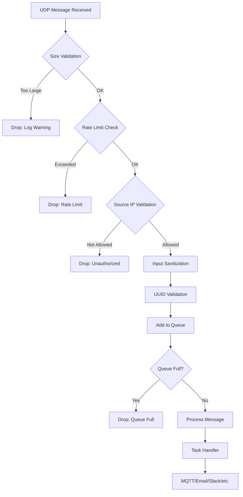
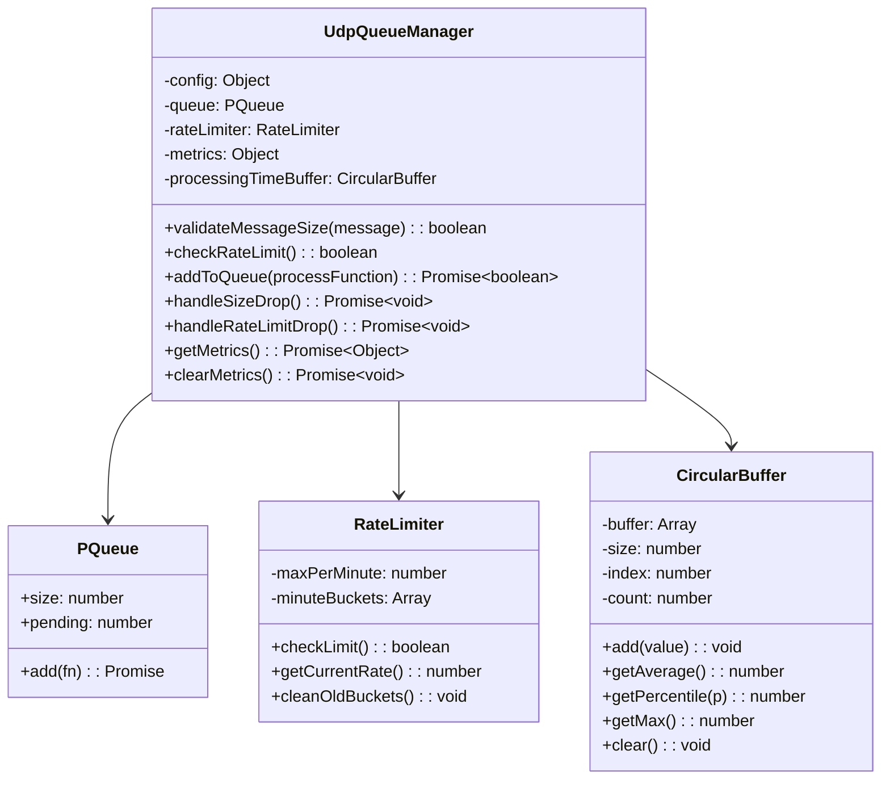

# UDP Queue Management - Completed Work

## Overview
This document describes the implementation of UDP queue management, input sanitization, UUID validation, and source IP validation in Butler's UDP server for handling Qlik Sense task events.

## Goals Achieved
- ✅ Harden UDP server against message flooding with queue management
- ✅ Add input sanitization to prevent malformed message processing
- ✅ Add UUID validation for Task ID and App ID fields
- ✅ Add source IP validation for incoming UDP messages
- ✅ Implement rate limiting (optional)
- ✅ Add queue metrics tracking (optional, InfluxDB support)

## Architecture

### Message Flow



### Queue Manager Components



## Files Changed

### New Files
| File | Purpose |
|------|---------|
| `src/lib/udp_queue_manager.js` | Queue management with `CircularBuffer`, `RateLimiter`, `UdpQueueManager` classes |
| `src/lib/udp_ip_validator.js` | Source IP and hostname validation utility |
| `src/lib/udp_sanitizer.js` | Input sanitization (control char removal, max length) |
| `src/lib/__tests__/udp_queue_manager.test.js` | Unit tests for queue manager (7 tests) |

### Modified Files
| File | Changes |
|------|---------|
| `src/butler.js` | Changed `reuseAddr: false`, added queue initialization |
| `src/udp/udp_handlers.js` | Integrated queue manager, added validations |
| `src/lib/guid_util.js` | Exported `guidRegex` for UUID validation |
| `src/lib/assert/config-file-schema.js` | Added `messageQueue`, `rateLimit`, `queueMetrics` schema |
| `src/globals.js` | Added `udpQueueManager`, `udpMaxMessageSize`, `udpEnableSourceValidation`, etc. |
| `src/config/production_template.yaml` | Documented new config options |

## Configuration

### New Config Options
```yaml
Butler:
  udpServerConfig:
    enable: true
    port: 9998
    serverLabel: task_failure
    reuseAddr: false  # Security: prevent port hijacking
    
    # Payload size limit (bytes)
    maxMessageSize: 65507
    
    # Source IP validation
    enableSourceValidation: false
    allowedSources: []
    
    # Message queue settings
    messageQueue:
      enable: true
      maxConcurrent: 5      # Max concurrent processing
      maxSize: 1000          # Max queue size
      backpressureThreshold: 0.8  # 80% threshold
    
    # Rate limiting
    rateLimit:
      enable: false
      maxMessagesPerMinute: 1000
    
    # Queue metrics (optional)
    queueMetrics:
      influxdb:
        enable: false
        writeFrequency: 20000
        measurementName: butler_udp_queue
```

## Test Results

```
Test Suites: 2 passed, 2 total
Tests:       27 passed, 27 total
  - 20 tests: src/udp/__tests__/udp_handlers.test.js
  - 7 tests:  src/lib/__tests__/udp_queue_manager.test.js
```

## Security Improvements

| Improvement | Description |
|-------------|-------------|
| `reuseAddr: false` | Prevents UDP port hijacking by other processes |
| Source IP validation | Only accept UDP messages from allowed IPs/hostnames |
| Payload size validation | Reject oversized UDP messages before processing |
| Input sanitization | Remove control characters, enforce max field length |
| UUID validation | Validate Task ID and App ID format before processing |
| Queue management | Prevent message flooding with configurable queue limits |
| Rate limiting | Optional rate limiting to prevent abuse |

## References
- Butler SOS implementation: `butler-sos/src/lib/udp-queue-manager.js`
- p-queue: https://github.com/sindresorhus/p-queue
- async-mutex: https://github.com/nicolo-ribaudo/async-mutex
