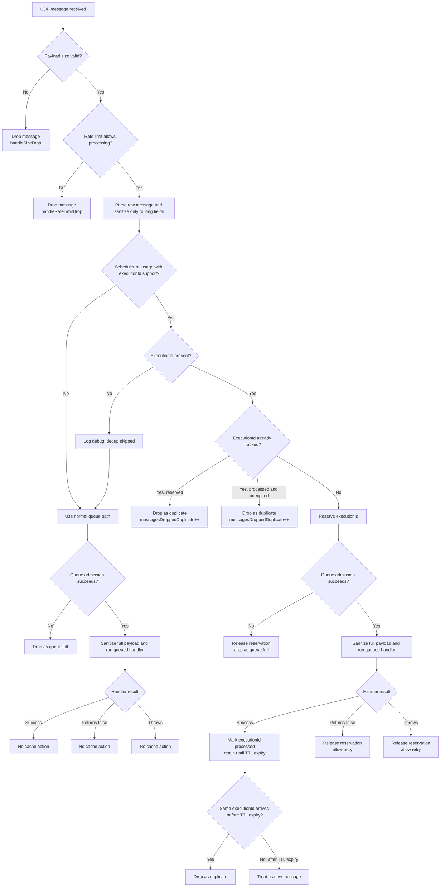

# UDP Message Deduplication and Queue Decision Tree

## What Changed

Butler now treats UDP deduplication as a queue lifecycle problem rather than a pre-queue filter.

The important behavior change is this:

1. A message is no longer considered permanently handled just because Butler saw its `executionId`.
2. An `executionId` is reserved during the deduplicated enqueue attempt and, if queue admission succeeds, while the message is queued or in flight.
3. The reservation is released if queue admission fails or if queued processing ends unsuccessfully.
4. The `executionId` is retained only after successful message handling.
5. Scheduler duplicates are now dropped before Butler spends CPU sanitizing the full payload.

This avoids the earlier failure mode where a queue-full drop or processing failure could poison an `executionId` and cause legitimate retries to be skipped.

## Where Deduplication Applies

Deduplication is based on the scheduler message `executionId`, which Butler reads from field `9` in scheduler UDP messages.

Examples of scheduler message families that can carry an `executionId` are:

- `/scheduler-reload-failed/`
- `/scheduler-task-failed/`
- `/scheduler-reloadtask-failed/`
- `/scheduler-reload-aborted/`
- `/scheduler-task-aborted/`
- `/scheduler-reloadtask-success/`
- `/scheduler-task-success/`
- `/scheduler-distribute/`

Some messages, such as engine reload failures, do not use this scheduler `executionId` field. Those messages bypass deduplication and follow the normal queue path.

## Decision Tree

## Outcome Table

The table below maps each queue and deduplication branch to operator-visible behavior.

| Scenario | ExecutionId present | Dedup state before check | Queue admission result | Processing result | Cache action | Metrics updated | Expected log signal | Retry allowed |
| --- | --- | --- | --- | --- | --- | --- | --- | --- |
| Message has no executionId and queue admission fails | No | Not applicable | Rejected because queue is full | Not run | None | `messagesReceived`, `messagesDroppedTotal`, `messagesDroppedQueueFull` | Periodic queue drop warning from the UDP queue manager | Yes. A later resend is treated as a fresh message. |
| Scheduler message that should have an executionId arrives without one | No | Not applicable | Follows normal queue admission path | Follows normal success or failure path | None | No special dedup metric. Subsequent queue metrics depend on the run outcome. | Debug log that deduplication was skipped because the scheduler message had no executionId | Yes. Without an executionId, Butler cannot deduplicate the message. |
| Message has no executionId, is queued, and processing succeeds | No | Not applicable | Accepted | Success | None | `messagesReceived`, `messagesQueued`, `messagesProcessed` | Normal handler logs for the message type | Yes. There is no dedup cache entry for this message. |
| Message has no executionId, is queued, and processing returns `false` or throws | No | Not applicable | Accepted | Unsuccessful | None | `messagesReceived`, `messagesQueued`, `messagesFailed` | Validation warning, unknown-type warning, or queue error log depending on failure mode | Yes. There is no dedup cache entry to block a resend. |
| Message has an executionId that is already reserved by an in-flight message | Yes | Reserved | Not attempted | Not run | Keep existing reservation | `messagesReceived`, `messagesDroppedTotal`, `messagesDroppedDuplicate` | Verbose duplicate log in the UDP handler | Not for that duplicate copy. A later resend can succeed if the in-flight message later releases the reservation. |
| Message has an executionId that was already processed successfully and TTL has not expired | Yes | Processed and unexpired | Not attempted | Not run | Keep processed entry until TTL expiry | `messagesReceived`, `messagesDroppedTotal`, `messagesDroppedDuplicate` | Verbose duplicate log in the UDP handler | No until TTL expiry. After TTL expiry, the same executionId is treated as new. |
| Message has a new executionId but queue admission fails | Yes | Not tracked | Rejected because queue is full | Not run | Reserve, then release immediately | `messagesReceived`, `messagesDroppedTotal`, `messagesDroppedQueueFull` | Periodic queue drop warning from the UDP queue manager | Yes. The reservation is released, so a resend can be accepted. |
| Message has a new executionId, is queued, and processing returns `false` | Yes | Not tracked | Accepted | Unsuccessful return | Reserve, then release | `messagesReceived`, `messagesQueued`, `messagesFailed` | Validation warning or unknown-type warning from the UDP handler | Yes. The reservation is released after unsuccessful handling. |
| Message has a new executionId, is queued, and processing throws | Yes | Not tracked | Accepted | Exception | Reserve, then release | `messagesReceived`, `messagesQueued`, `messagesFailed` | Queue error log from the UDP queue manager, plus any downstream error logs | Yes. The reservation is released after the exception path. |
| Message has a new executionId, is queued, and processing succeeds | Yes | Not tracked | Accepted | Success | Reserve, then mark processed | `messagesReceived`, `messagesQueued`, `messagesProcessed` | Normal handler logs for the message type | No until TTL expiry. Duplicates with the same executionId are dropped during the TTL window. |
| Message with a previously processed executionId arrives after TTL expiry | Yes | Expired entry, treated as not tracked | Evaluated as a new queue admission | Follows normal success or failure path | Expired entry removed during lookup, then normal reserve or queue path | No dedicated TTL metric. Subsequent queue metrics depend on the new run outcome. | No dedicated TTL-expiry log | Yes. TTL expiry intentionally reopens the executionId for a future message. |

## Retry Semantics

The retry rule is now simple:

1. If Butler never queued the message, the `executionId` must not remain blocked.
2. If Butler queued the message but the handler did not complete successfully, the `executionId` must not remain blocked.
3. Only a successful message handling path keeps the `executionId` in the cache.

This means retries are accepted after:

- queue-full rejection
- validation-driven unsuccessful handling
- handler exceptions
- TTL expiry after a prior successful run

Retries are rejected only while the `executionId` is still legitimately in flight or still within the post-success TTL window.

## Metrics and Logs to Watch

These metrics are the primary signals for operators monitoring this behavior:

- `messagesDroppedDuplicate`: incremented when Butler drops a message because the same `executionId` is already reserved or already processed and unexpired.
- `messagesDroppedQueueFull`: incremented when Butler cannot admit a message to the queue.
- `messagesProcessed`: incremented when queued processing completes successfully.
- `messagesFailed`: incremented when queued processing returns `false` or throws.
- `deduplicationCacheSize`: current number of tracked execution IDs, including in-flight reservations and successfully processed entries that have not yet expired.

The most useful logs are:

- `[QSEOW] UDP HANDLER: Duplicate message detected ...` for duplicate suppression.
- `[QSEOW] UDP HANDLER: Scheduler message type ... has no executionId. Skipping deduplication for this message.` when Butler receives a scheduler-family message that cannot be deduplicated safely.
- handler validation warnings such as invalid field counts or invalid GUIDs for unsuccessful but non-exceptional processing.
- `[UDP Queue] Error processing message ...` when queued work throws.
- periodic queue drop warnings when queue-full conditions persist.

There is currently no dedicated log line for TTL expiry. Expiry is handled silently by the deduplication cache.

## TTL Behavior

The deduplication TTL is configurable with `Butler.udpServerConfig.deduplicationTtlMinutes`.

If you do not set that key, Butler defaults to `10` minutes.

This means:

1. A successfully handled scheduler message suppresses duplicates for the configured TTL window.
2. An executionId does not stay blocked forever.
3. Once the TTL expires, the next message with that executionId is evaluated as a new message.

## Why This Design Matters

Qlik Sense can emit near-identical scheduler events close together. Deduplication is therefore necessary to avoid duplicate notifications and duplicate downstream actions.

At the same time, deduplication must not be stronger than delivery correctness. If Butler rejects a message because the queue is full, or if queued processing fails, suppressing later retries would hide a real task event from downstream notifications.

The queue-safe design resolves that tradeoff by aligning deduplication with actual message handling outcomes.
