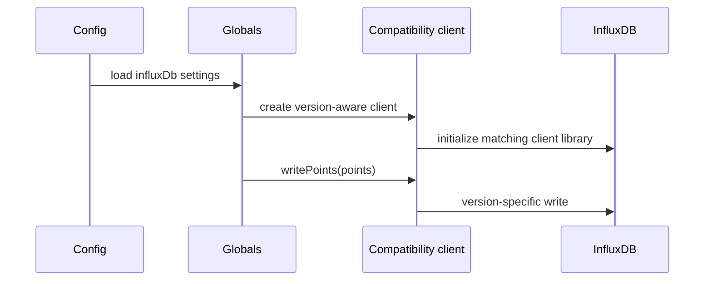

# InfluxDB v2 and v3 support in Butler

## Goal

Add Butler support for InfluxDB v2 and v3 without rewriting the existing event-producing code that already targets the legacy InfluxDB v1 client API.

## Design

The implementation keeps Butler's existing `globals.influx.writePoints(...)` contract intact.
Instead of changing every caller, Butler now creates a small compatibility client during startup:

- **InfluxDB v1**: forwards calls to the existing `influx` package.
- **InfluxDB v2**: converts legacy Butler point objects into `@influxdata/influxdb-client` `Point` instances and writes them via `getWriteApi(...)`.
- **InfluxDB v3**: converts legacy Butler point objects into `@influxdata/influxdb3-client` `Point` instances, serializes them to line protocol, and writes them to the configured database.

This keeps the change set focused in startup/config/runtime glue while preserving current v1 behavior.

```mermaid
flowchart LR
    A[Butler event code<br/>writePoints legacy payload] --> B[Compatibility client]
    B -->|version 1| C[influx package]
    B -->|version 2| D[@influxdata/influxdb-client]
    B -->|version 3| E[@influxdata/influxdb3-client]
```

## Configuration model

The Butler config template now uses the same high-level versioned concept as Butler-SOS:

- `Butler.influxDb.version`
- `Butler.influxDb.v1Config`
- `Butler.influxDb.v2Config`
- `Butler.influxDb.v3Config`

For backward compatibility, Butler still accepts the legacy flat v1 settings (`auth`, `dbName`, `retentionPolicy`) when `version` is omitted.

## Startup behavior

- **v1**: Butler keeps the previous behavior and can create the database and retention policy if needed.
- **v2 / v3**: Butler connects using the configured credentials and writes using the modern client libraries. Butler does **not** auto-create v2 buckets or v3 databases.



## Result

- Butler can now target **InfluxDB v1, v2, and v3**.
- Existing InfluxDB-producing Butler modules continue to use the same write API.
- Sensitive v2/v3 tokens are obfuscated in config visualisation output.
- Schema and tests were updated to cover the new versioned configuration structure.
