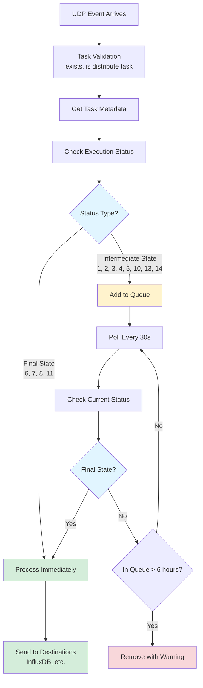

# Distribution Task Queue

## Overview

The Distribution Task Queue is a specialized component designed to handle distribution tasks in Qlik Sense that may not have reached a final state when the UDP completion event arrives. This commonly occurs when distributing large apps to cloud targets, where the distribution process continues after the initial event is received.

## Problem Statement

When a distribution task completes in Qlik Sense Enterprise on Windows (QSEOW), a UDP event is sent to Butler. However, for distribution tasks (especially those distributing to cloud), the task's execution status may still be in an intermediate state when the event arrives:

- **Intermediate states**: Triggered (1), Started (2), Queued (3), AbortInitiated (4), Aborting (5), Retry (10), DistributionQueue (13), DistributionRunning (14)
- **Final states**: Aborted (6), FinishedSuccess (7), FinishedFail (8), Error (11)

If Butler tries to process the task immediately, it may not have the complete execution results available, leading to incomplete or missing metrics in InfluxDB and other destinations.

## Solution

The Distribution Task Queue provides a polling mechanism that:

1. **Queues intermediate-state tasks**: When a distribution event arrives with an intermediate execution status, the task is added to a queue instead of being processed immediately
2. **Periodic polling**: Every 30 seconds, the queue checks all tasks to see if they've reached a final state
3. **Automatic processing**: Once a task reaches a final state (success, failure, abort, or error), it's automatically processed and sent to configured destinations (InfluxDB, etc.)
4. **Timeout protection**: Tasks that remain in the queue for more than 6 hours are automatically removed with a warning logged

## Architecture

### Components

- **`distribution_queue.js`**: Main queue implementation with polling logic
- **`distribute_task_completion.js`**: UDP event handler that routes tasks to queue or immediate processing
- **Queue storage**: In-memory Map for storing pending tasks with metadata

### Data Flow



## Configuration

The queue uses default values that can be customized during instantiation:

```javascript
const queue = new DistributionTaskQueue(
    30000, // Poll interval: 30 seconds
    6 * 60 * 60 * 1000, // Max age: 6 hours
);
```

### Parameters

- **`pollIntervalMs`**: How often to check queued tasks (default: 30000ms = 30 seconds)
- **`maxAgeMs`**: Maximum time a task can remain in queue (default: 6 hours)

## Usage

The queue is implemented as a singleton and automatically used by the `distribute_task_completion` handler:

```javascript
// Automatic usage in distribute_task_completion.js
if (executionStatus === 7) {
    // Final state - process immediately
    await handleSuccessDistributeTask(msg, taskMetadata);
} else if (distributionQueue.isIntermediateState(executionStatus)) {
    // Intermediate state - add to queue
    distributionQueue.add(taskId, msg, taskMetadata);
}
```

### Manual Usage

If needed, you can interact with the queue directly:

```javascript
import distributionQueue from './distribution_queue.js';

// Add a task to the queue
distributionQueue.add(taskId, udpMessage, taskMetadata);

// Get queue statistics
const stats = distributionQueue.getQueueStats();
console.log(`Queue size: ${stats.size}`);
console.log(`Oldest task: ${stats.oldestTaskAgeMinutes} minutes`);
console.log(`Average checks per task: ${stats.averageCheckCount}`);

// Clear the queue (useful for testing or emergency situations)
distributionQueue.clear();
```

## Monitoring

The queue provides extensive logging for monitoring:

### Log Levels

- **INFO**: Task additions, removals, polling start/stop
- **DEBUG**: Periodic status checks, intermediate state updates
- **WARN**: Tasks exceeding max age, unexpected statuses
- **ERROR**: Exceptions during task processing or metadata retrieval

### Example Logs

```text
[QSEOW] DISTRIBUTION QUEUE: Added task Distribution to Production (abc-123) to queue. Queue size: 1
[QSEOW] DISTRIBUTION QUEUE: Starting periodic polling (interval: 30000ms, max age: 21600000ms)
[QSEOW] DISTRIBUTION QUEUE: Task Distribution to Production (abc-123) status: 14 (check #1)
[QSEOW] DISTRIBUTION QUEUE: Task Distribution to Production (abc-123) reached final state 7. Processing and removing from queue.
[QSEOW] DISTRIBUTION QUEUE: Removed 1 task(s) from queue. Remaining: 0
```

## Performance Considerations

### Memory Usage

- Each queued task stores: UDP message array, task metadata object, timestamps, check count
- Typical task size: ~2-5 KB
- Maximum tasks (6-hour timeout): Limited by your distribution frequency

### CPU Usage

- Polling every 30 seconds is minimal overhead
- API calls to QRS for task metadata happen only for queued tasks
- Polling automatically stops when queue is empty

### Network Usage

- One QRS API call per queued task every 30 seconds
- For 10 queued tasks: 20 API calls per minute
- Negligible compared to other Butler operations

## Error Handling

The queue implements robust error handling:

1. **Metadata retrieval failures**: Task remains in queue, retry on next poll
2. **Processing failures**: Error logged, task removed from queue to prevent blocking
3. **QRS API errors**: Caught and logged, queue continues with other tasks
4. **Timeout protection**: Automatic removal of stale tasks

## Testing

Comprehensive test coverage includes:

- Queue management (add, update, clear)
- State detection (final vs intermediate)
- Periodic polling behavior
- Timeout handling
- Error scenarios
- Integration with distribute_task_completion handler

Run tests:

```bash
npm test -- src/udp/handlers/__tests__/distribution_queue.test.js
npm test -- src/udp/handlers/__tests__/distribute_task_completion.test.js
```

## Future Enhancements

Possible improvements:

1. **Configurable polling interval**: Allow configuration via Butler config file
2. **Queue persistence**: Survive Butler restarts by persisting queue to disk
3. **Priority queue**: Process certain tasks before others
4. **Metrics endpoint**: Expose queue statistics via API
5. **Alerting**: Send notifications when queue size exceeds threshold

## Task Status Reference

### Qlik Sense Task Execution Statuses

| Code | Status Name         | Category     | Queue Action       |
| ---- | ------------------- | ------------ | ------------------ |
| 0    | NeverStarted        | Unexpected   | Log warning        |
| 1    | Triggered           | Intermediate | Add to queue       |
| 2    | Started             | Intermediate | Add to queue       |
| 3    | Queued              | Intermediate | Add to queue       |
| 4    | AbortInitiated      | Intermediate | Add to queue       |
| 5    | Aborting            | Intermediate | Add to queue       |
| 6    | Aborted             | Final        | Process as failure |
| 7    | FinishedSuccess     | Final        | Process as success |
| 8    | FinishedFail        | Final        | Process as failure |
| 9    | Skipped             | Unexpected   | Log warning        |
| 10   | Retry               | Intermediate | Add to queue       |
| 11   | Error               | Final        | Process as failure |
| 12   | Reset               | Unexpected   | Log warning        |
| 13   | DistributionQueue   | Intermediate | Add to queue       |
| 14   | DistributionRunning | Intermediate | Add to queue       |

## Troubleshooting

### Task stuck in queue

**Symptom**: Task remains in queue for extended period

**Possible causes**:

- QRS API not responding
- Task truly taking long time to complete
- Network connectivity issues

**Solution**:

- Check Butler logs for API errors
- Verify Qlik Sense QMC shows task completion
- Check network connectivity to QRS

### Queue growing without limit

**Symptom**: Queue size continuously increases

**Possible causes**:

- All distributions taking longer than 6 hours
- QRS API always returning intermediate states
- Bug in status checking logic

**Solution**:

- Review distribution task designs (target size, network bandwidth)
- Verify QRS API health
- Check Butler debug logs for status check results

### Tasks not being processed

**Symptom**: Tasks reach final state but don't get sent to destinations

**Possible causes**:

- Error in processing logic
- InfluxDB or other destination unavailable

**Solution**:

- Check Butler error logs for processing errors
- Verify destination service (InfluxDB) is accessible
- Test with immediate processing (final state tasks)
